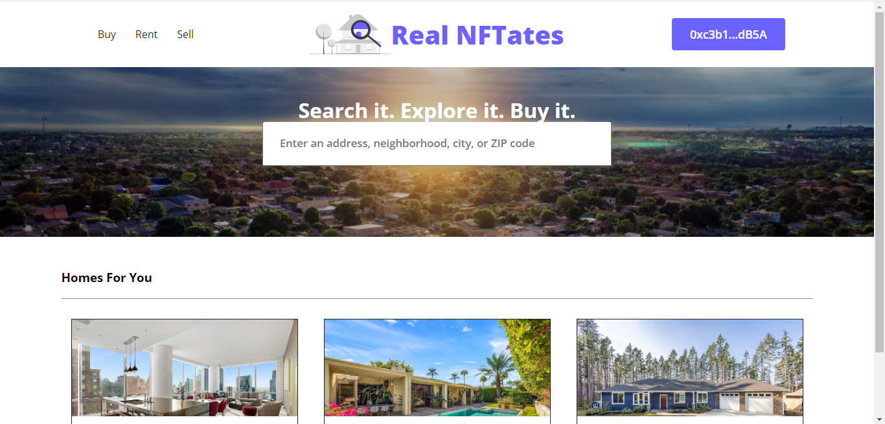

# Real Estate NFT DApp

# Introduction

RealNFTates is a Real Estate DApp It allows purchasing and selling real estates properties as NFTs. You can list properties online with the blockchain and let people buy them directly with their blockchain wallet.
It has an entire process to go through a real estate transaction like escrow and lending inspection
The User will  connect with their wallet like Metamask and essentially they will talk to this website which is a web application made with React.js, a popular modern frontend framework 
This website is going to talk directly to the NFTs smart contract that we have created for this application.

Each property is going to be represented by an individual nft and by clicking the BUY button it will put the property in escrow so that it has to be approved uh you know by other parties and funded before it can
actually finalize the transaction and the ownership of the property will change based on the NFt TO the seller
We opted to use the ERC 721 standard which is the standard for non-fungible tokens or NFTs.

The final interface made with React

## Technology Stack & Tools

- Solidity (Writing Smart Contracts & Tests)
- Javascript (React & Testing)
- [Hardhat](https://hardhat.org/) (Development Framework)
- [Ethers.js](https://docs.ethers.io/v5/) (Blockchain Interaction)
- [React.js](https://reactjs.org/) (Frontend Framework)

## Requirements For Initial Setup
- Install [NodeJS](https://nodejs.org/en/)

## Setting Up
### 1. Clone/Download the Repository

### 2. Install Dependencies:
`$ npm install`

### 3. Run tests
`$ npx hardhat test`

### 4. Start Hardhat node
`$ npx hardhat node`

### 5. Run deployment script
In a separate terminal execute:
`$ npx hardhat run ./scripts/deploy.js --network localhost`

### 7. Start frontend
`$ npm run start`

## Video